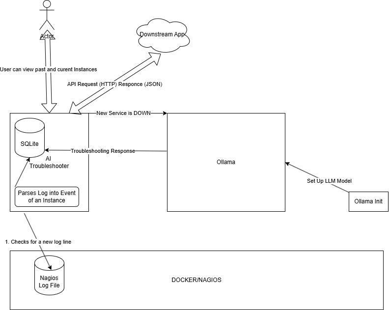
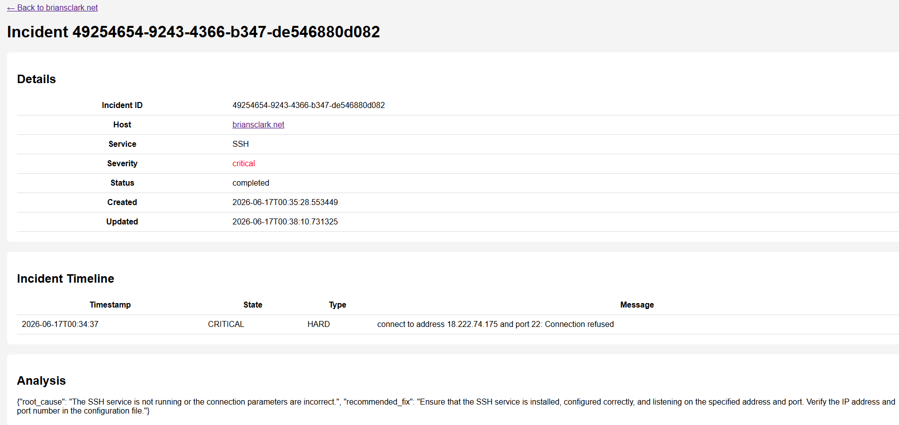

# AI Troubleshooter

> **AI-powered incident analysis for Nagios environments — fully local, no cloud dependencies.**

---

## Overview

AI Troubleshooter is an open-source AIOps platform that bridges the gap between monitoring alerts and actionable remediation. It continuously monitors Nagios log files, detects host and service failures, stores incidents in a local database, and uses a locally hosted Large Language Model via [Ollama](https://ollama.com) to generate intelligent troubleshooting recommendations — automatically, in real time.

Designed for system administrators, network operations centers, and infrastructure teams, AI Troubleshooter reduces mean time to resolution by surfacing likely root causes before an engineer has opened a terminal.

---

## Why AI Troubleshooter

Traditional monitoring platforms like Nagios excel at detecting failures. They do not tell you why something failed or what to do about it.

AI Troubleshooter fills that gap by combining live monitoring events, historical incident data, and locally hosted LLMs into a single, lightweight analysis pipeline. Every recommendation is generated on-premise — your infrastructure data never leaves your environment.

Built as a practical exploration of AIOps techniques, the project is designed to remain accessible to home labs and small enterprises while scaling to production data center environments.

---

## Features

- Continuous Nagios log monitoring with log rotation awareness
- Automated incident ingestion, normalization, and severity classification
- AI-powered troubleshooting recommendations via local LLM
- Historical incident storage and similar incident retrieval
- Knowledge base integration for known issue patterns
- Queue-based asynchronous processing pipeline
- Incident trend analysis and dashboard reporting
- Batch log analysis
- Retry handling for failed AI requests
- Docker deployment support

---

## Technology Stack

| Layer | Technology |
|---|---|
| Backend | FastAPI 0.136, Uvicorn, Starlette |
| AI / LLM | Ollama · `qwen2.5:1.5b` (default, swappable) |
| Storage | SQLite |
| Frontend | Jinja2 Templates, HTML Dashboard |
| Networking | HTTPX, Requests |
| Containerization | Docker, Docker Compose |
| Language | Python 3.12+ |

---

## Prerequisites

- Docker and Docker Compose
- IF not using Docker:
- Nagios
- Python 3.12+
- Ollama

---

## Deployment

### Docker (Recommended)

The application runs as a multi-container stack with three services:

| Container | Role |
|---|---|
| `ai-troubleshooter` | Main application |
| `ollama` | Local LLM serving platform |
| `ollama-init` | One-time model download (auto-runs on first start) |
| `nagios` | Preconfigured to check containers and has a directory for customization |

**Default model:** `qwen2.5:1.5b`

```bash
# Start
docker compose up -d

# View logs
docker compose logs -f

# Stop
docker compose down
```

**Volume Mounts**

| Purpose | Host Path | Container Path |
|---|---|---|
| Nagios logs | `/usr/local/nagios/var` | `/logs` |
| Ollama model data | *(persistent volume)* | `ollama` |
| Nagios conf.d | `nagios/conf.d` | `/opt/nagios/etc/conf.d` |

**Environment Variables**

| Variable | Default |
|---|---|
| `OLLAMA_URL` | `http://ollama:11434/api/chat` |
| `NAGIOSLOGFILE` | `/logs/nagios.log` |

---

### Manual Installation

```bash
# 1. Clone the repository
git clone https://github.com/bsclark75/ai-troubleshooter.git

# 2. Create and activate a virtual environment
python3 -m venv venv
source venv/bin/activate

# 3. Install dependencies
pip install -r requirements.txt

# 4. Set environment variables
export OLLAMA_URL=http://localhost:11434/api/chat
export NAGIOSLOGFILE=/usr/local/nagios/var/nagios.log

# 5. Start Ollama and pull the model
ollama serve
ollama pull qwen2.5:1.5b

# 6. Start the application
uvicorn main:app --host 0.0.0.0 --port 8000
```

Access the dashboard at `http://localhost:8000/dashboard`.

---

## Architecture



AI Troubleshooter is organized into five major layers:

```
Nagios Log → Log Watcher → Incident Parser → Queue → AI Analysis → Dashboard
                                                  ↑
                                     Historical Incidents + Knowledge Base
```

| Layer | Component | Description |
|---|---|---|
| Log Monitoring | `log_watcher.py` | Continuously tails Nagios logs for new events |
| Processing Pipeline | `ingestion_service.py`, `severity_service.py` | Parses, normalizes, and classifies incidents |
| AI Analysis | `ai_service.py`, `incident_processor.py` | Submits incident context to Ollama; retrieves results |
| Knowledge Layer | `retrieval_service.py`, `knowledge_service.py` | Searches historical incidents and known issue patterns |
| Web Interface | FastAPI + Jinja2 | Dashboard with incident views, trends, and AI recommendations |

### Workflow

1. Nagios writes events to `nagios.log`
2. Log Watcher detects new entries
3. Events are parsed into incidents and classified by severity
4. Incidents are stored in SQLite and queued for analysis
5. Historical incidents and known issues are retrieved for context
6. Context is submitted to Ollama
7. AI generates analysis and recommendations
8. Results are stored and surfaced in the dashboard

---

## API Reference

### General

| Method | Endpoint | Description |
|---|---|---|
| `GET` | `/` | Application landing endpoint |
| `GET` | `/health` | Health check |

### Analysis

| Method | Endpoint | Description |
|---|---|---|
| `GET` | `/analyze` | Analyze a single incident or log sample |
| `POST` | `/analyze/batch` | Batch incident analysis |

### Incidents

| Method | Endpoint | Description |
|---|---|---|
| `GET` | `/incidents` | List all incidents |
| `GET` | `/incident/{id}` | Retrieve a specific incident |
| `GET` | `/incident/{id}/ui` | Incident detail view |

### Hosts

| Method | Endpoint | Description |
|---|---|---|
| `GET` | `/host/{host}` | Incidents for a specific host |
| `GET` | `/host/{host}/ui` | Host dashboard view |

### Monitoring & Metrics

| Method | Endpoint | Description |
|---|---|---|
| `GET` | `/queue` | Current processing queue |
| `GET` | `/processing` | Incidents currently being analyzed |
| `GET` | `/failures` | Failed processing attempts |
| `GET` | `/stats` | System statistics and metrics |
| `GET` | `/dashboard` | Main operational dashboard |

---

## Database Schema

AI Troubleshooter uses SQLite for lightweight, portable persistent storage.

```sql
   CREATE TABLE IF NOT EXISTS incidents (
        id TEXT PRIMARY KEY,
        host TEXT NOT NULL,
        service TEXT NOT NULL,
        severity TEXT,
        analysis TEXT,
        status TEXT,
        retry_count INTEGER DEFAULT 0,
        opened_at TEXT,
        closed_at TEXT,
        next_retry_at TEXT,
        created_at TEXT,
        updated_at TEXT
    )
    """)

    cursor.execute("""
    CREATE TABLE IF NOT EXISTS incident_events (
        id INTEGER PRIMARY KEY AUTOINCREMENT,
        incident_id TEXT NOT NULL,
        timestamp TEXT,
        notification_type TEXT,
        state TEXT,
        state_type TEXT,
        attempt INTEGER,
        message TEXT,
        raw_log TEXT,
        FOREIGN KEY (incident_id)
            REFERENCES incidents(id)
    )
    """)
```

---

## Knowledge Base

A local knowledge repository at `knowledge/common_issues.json` allows teams to supply known issue patterns that improve AI recommendations.

Each entry supports:
- Common symptoms
- Root causes
- Recommended fixes
- Troubleshooting procedures

This forms the foundation for future RAG (Retrieval-Augmented Generation) capabilities.

---
## Screenshots



---
## Roadmap

- Historical incident correlation
- Similar incident search
- Incident trend analysis
- Email reports
- Enrichment of system logs
- RCA generation
- Change correlation
- Executive Reports
- SLA Reporting
- multisite monitoring
- Additional monitoring platform integrations (beyond Nagios)

---

## Use Cases

- Linux server administration
- Network operations centers (NOC)
- Infrastructure and data center monitoring
- Managed service providers
- Home labs and self-hosted environments
- Small and medium businesses
- Bitcoin mining facility operations

---

## Design Principles

- **Local-first AI** — all LLM processing runs on-premise; no data leaves the environment
- **Operational simplicity** — minimal dependencies, single-command Docker deployment
- **Incident memory** — historical data improves recommendations over time
- **Lightweight by design** — runs on home lab hardware, not just enterprise infrastructure
- **Extensible** — built to support RAG, additional models, and new monitoring platforms

---

## Author

**Brian Clark**  
IT Infrastructure & Systems Administration  
[briansclark.net](https://briansclark.net)

---

## Project Status

**Active Development**

Current focus: RAG implementation, incident correlation, trend analysis, automated remediation workflows, and integration with additional monitoring platforms.

---

## License

Provided for educational and operational use. Always review AI-generated recommendations before applying changes to production systems.